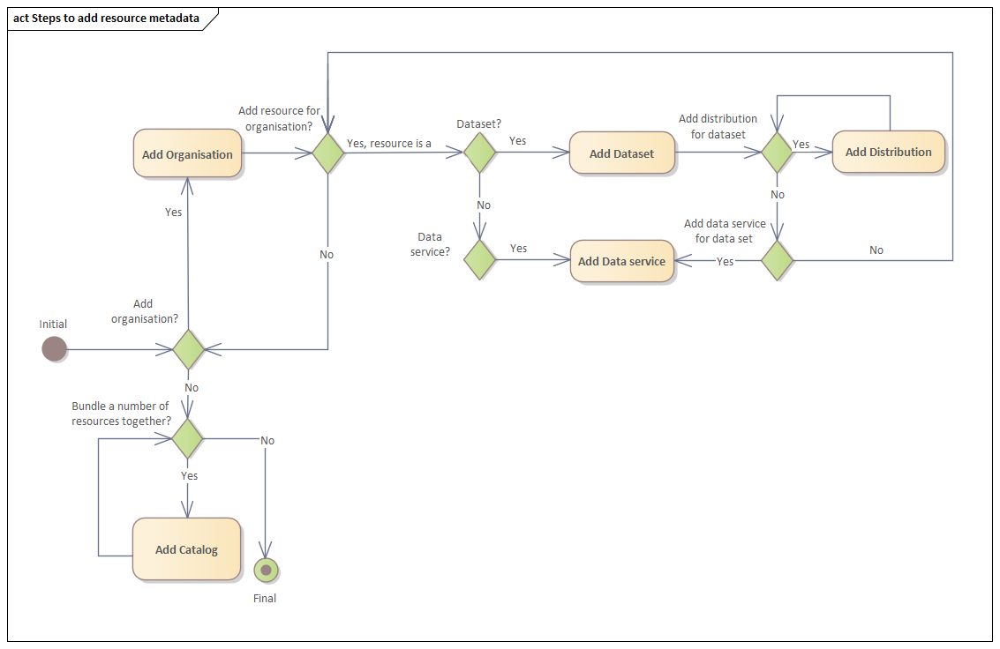

> **Nota** Hay disponibles versiones en español de cualquiera de las secciones de esta documentación, a las que puedes acceder haciendo click en el botón que se encuentra en la parte superior izquierda de cada pantalla

# How to describe a resource
Here we list the steps to describe the metadata for a FLAIR-GG resource.

## Step 1
Download the [Excel spreadsheet](FLAIR-GG%20Resource%20Metadata%20template.xlsx) or make a copy of the Google spreadsheet
[FLAIR-GG Resource Metadata template](https://docs.google.com/spreadsheets/d/1hHY6DmIrxGKTJbxrskprdvO-BiaxS8MZ/edit?usp=sharing&ouid=107877758444685576540&rtpof=true&sd=true).

## Step 2
Fill in the different sheets in the spreadsheet as is appropriate for your organisation or organisations and the resources
they provide.

> **Note** The template has an example line in each sheet that contains the real metadata from the Banco de Germoplasma Vegetal César Gómez Campo so you can use it to guide your decisions.

1. [Organisation](Organisation.md) - In order to add resources to the FLAIR-GG Virtual Platform the organisations that provide
the resources need to be registered first. To add an organisation or organisations, the Organisation sheet needs to be 
filled in. For each organisation, the datasets (which may have associated
data services) or data services (with no specific dataset), provided by the organisation, need to be added.   
   1. [Dataset](Dataset.md) - This sheet needs to be filled only when your organisation provides access to 1 or more datasets. 
   This sheet captures details about your dataset(s). However, a single dataset can have different ways in which they 
   are made available to potential users. How a dataset can be accessed is defined in the Distribution sheet.
      1. [Distribution](Distribution.md) - A single dataset can be made available in different ways. I.e., it can be downloaded or
      it can be accessed online.
   The [contact point](ContactPoint.md) for this dataset needs to be added if it has not already been added.
   2. [Data Service](DataService.md) - If your organisation provides a service for its dataset to browse or search the 
   dataset across different versions of the dataset, this sheet needs to be filled in. The [contact point](ContactPoint.md) for
   this data service needs to be added if it has not already been added.
2. [Catalog](Catalog.md) - If your organisation wants to bundle numerous datasets or data services together under a single title, you need to fill in this sheet. The [contact point](ContactPoint.md) for this 
catalog needs to be added if it has not already been added.

## Step 3
Export the spreadsheet. We recommend you export the spreadsheet as a tab-delimited (TSV) file. This is because it is very likely
that commas will be used in descriptions, addresses etc. 

